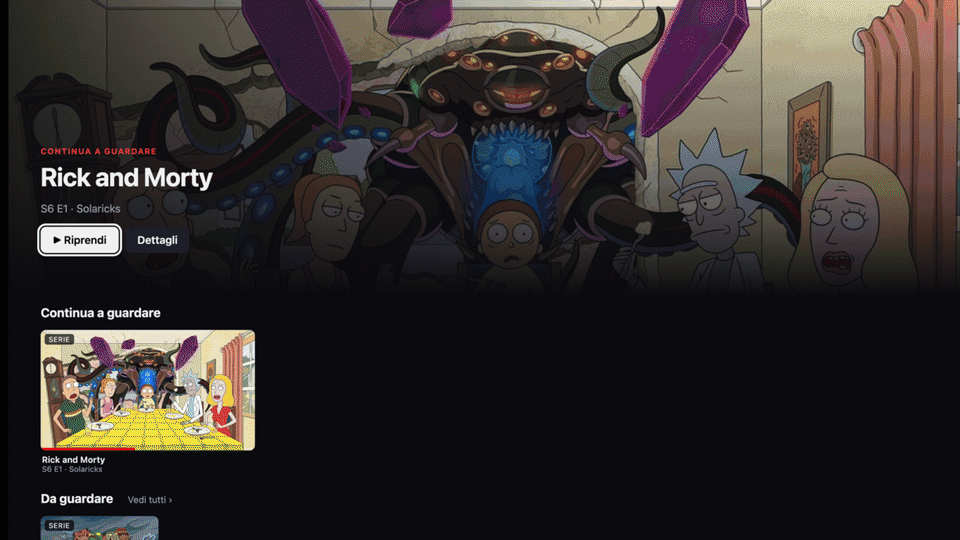
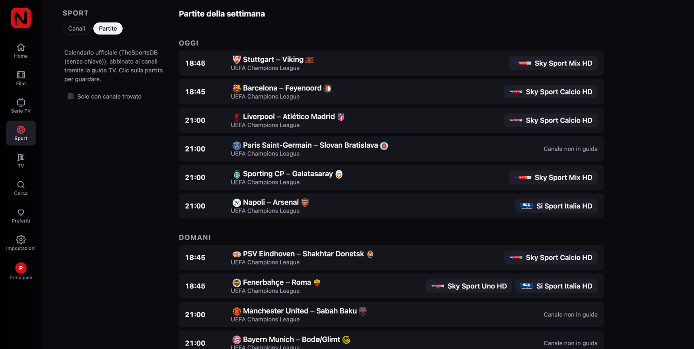
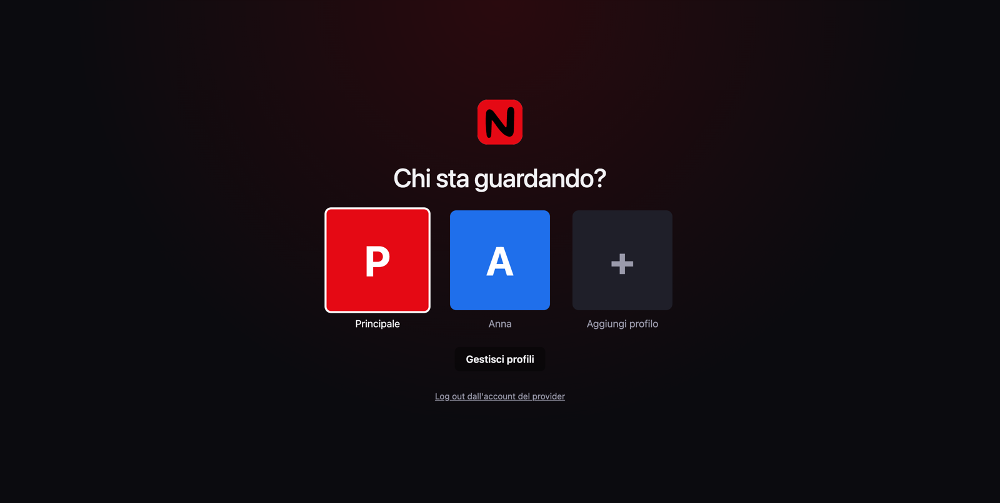
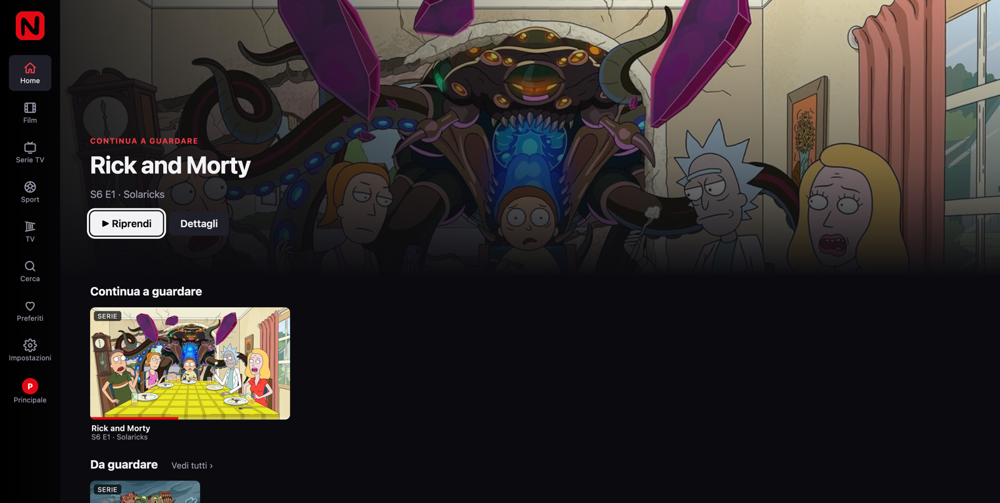
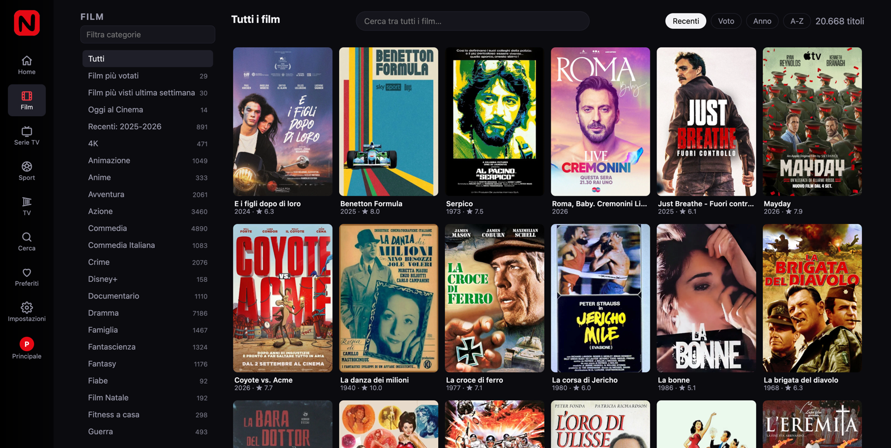
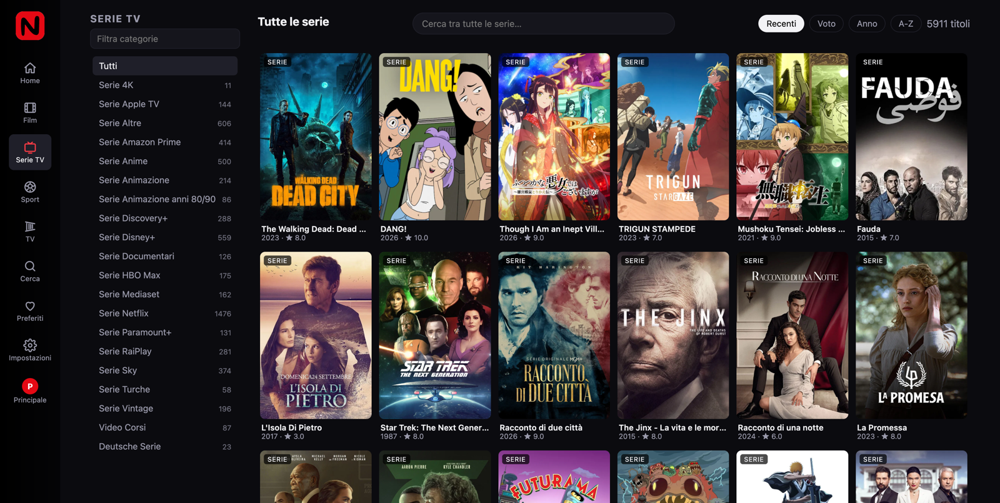

<p align="center">
  
</p>

<h1 align="center"></h1>

<p align="center"><b>I got tired of ugly IPTV apps,<br/>so I built my own.</b></p>

<p align="center">
  
</p>

<p align="center">
  It's not Netflix.<br/>It's <code>Neftlix</code>.<br/><br/>
  An open-source streaming client for the Xtream IPTV account you already have.<br/>
  Movies, series, live TV and sport, with a UX that doesn't feel like 2009.<br/>
  <a href="https://neftlix.tv">neftlix.tv</a>
</p>

<p align="center">
  <a href="https://github.com/c4rtical/neftlix/actions/workflows/ci.yml"></a>
  <a href="LICENSE"></a>
  
  <a href="https://buymeacoffee.com/neftlix"></a>
</p>

> **`Neftlix`&nbsp;does not provide any content.** No channels, no playlists, no servers, no credentials. You connect the Xtream Codes account you already own. Full disclaimer at the [bottom](#disclaimer).

⭐ Star this project if you like it. It's the only metric I look at.

---

## Get it

Download the latest build from [Releases](https://github.com/c4rtical/neftlix/releases/latest):

| | File | First launch |
|---|---|---|
| **Windows** | `Neftlix-Setup-x.y.z.exe` | SmartScreen shows "unknown publisher": click *More info* → *Run anyway*. |
| **macOS** | `Neftlix-x.y.z-universal.dmg` | Drag `Neftlix`&nbsp;to Applications. The app isn't signed yet, so macOS says it is "damaged": run `xattr -cr /Applications/Neftlix.app` once in Terminal, or right-click → *Open*. |

Double-click, enter your provider's host, username and password, watch. No Node, no terminal. Everything runs on your machine (127.0.0.1 only) and your credentials never leave it. The app checks GitHub Releases for updates.

Prefer to run it yourself, on a PC or a NAS, and open it from any device on your network?

```bash
git clone https://github.com/c4rtical/neftlix.git
cd neftlix
npm install
npm start
```

Open <http://localhost:8787>. Requires [Node.js](https://nodejs.org) 23.6 or newer. Chrome/Chromium/Edge recommended (Safari cannot play `.mkv`). The first sync downloads the whole catalogue (about 45 MB for 100k titles) and takes a few seconds.

<details>
<summary><b>Docker</b></summary>

```bash
docker run -d --name neftlix -p 8787:8787 -v neftlix-data:/data ghcr.io/c4rtical/neftlix
```

Or with Compose: `docker compose up -d` (see [`docker-compose.yml`](docker-compose.yml)).
</details>

<details>
<summary><b>Configuration</b> (all optional, environment variables)</summary>

| Variable | Default | Purpose |
|---|---|---|
| `PORT` | `8787` | HTTP port |
| `HOST` | `0.0.0.0` | Bind address (`127.0.0.1` to keep it local) |
| `NEFTLIX_DATA` | `./data` | Where the SQLite database lives |
| `NEFTLIX_PASSWORD` | – | If set, the whole app asks for this password (HTTP basic auth). Use it when exposing `Neftlix`&nbsp;beyond your home network. |
| `FOOTBALL_DATA_KEY` | – | Free [football-data.org](https://www.football-data.org/client/register) key for a richer fixtures calendar. Can also be set from Settings. |
| `LOG_LEVEL` | `info` | Fastify log level |
</details>

<details>
<summary><b>Keyboard / remote</b></summary>

| Key | Action |
|---|---|
| Arrows | Move focus |
| Enter | Open / play |
| Esc, Backspace | Close the player or the detail page |
| In the player: ← → | Seek ±10 s |
| In the player: ↑ ↓ | Seek ±60 s (live: next / previous channel) |
| Space | Play / pause |
| N | Next episode |
| F | Fullscreen |
| M | Mute |
</details>

---

## Why?

| What your provider gives you | What you get |
|---|---|
| 8,000 channels in one flat list | A home page built around what *you* watch |
| A search box | Movies and series with posters, plot, cast, seasons and episodes |
| "Season 2 Episode 7" as a file name | Continue watching, next episode, new episodes of the series you follow |
| Movie duplicated in 4 categories | One catalogue, merged and cleaned |
| A sport channel named `UK: SPORT 3 HD` | Tonight's match, on the channel that actually broadcasts it |
| An app designed for a remote from 2009 | Something that looks like the streaming services you pay for |

Classic IPTV players are channel lists with a search box. `Neftlix`&nbsp;treats your provider's catalogue like a streaming service.

---

## Features

- 🎬 **Movies** with posters, plot, cast, per-category search and sorting
- 📺 **Series** with seasons and episodes, auto-marked as watched, "next episode"
- 📡 **Live TV**: every channel of your provider, channel up/down in the player
- 🗓 **EPG**: what's on air now, from your provider's XMLTV guide
- 👤 **Profiles**: "Who's watching?", up to 5 per installation, each with its own progress
- ▶ **Continue watching**: resume where you left off, on any device
- ❤️ **Watchlist** and favourites, per profile
- ⚽ **Sports matching**: official kick-off times matched to the channel carrying the game
- 🔎 **Search** across movies, series and channels
- 🎞 **Player**: HLS via hls.js, keyboard and remote shortcuts, resume position
- 🧹 **Smart catalogue**: duplicates merged, dead sources skipped, TMDB ids and ratings kept
- 📱 **Works everywhere**: phone to TV, D-pad navigation, installable as a PWA

---

## Then it got a little out of hand

It started as "a nicer list of movies". Then I wanted the football fixtures. Then the TV. Then my family wanted their own profiles.

<table>
<tr>
<td width="50%"><br/><b>Sport fixtures.</b> Real kick-off times from a football calendar, matched to the channel that broadcasts the game. Live matches show up on the home page.</td>
<td width="50%"><b>Open from the TV.</b> Settings → <i>Apri dalla TV</i> → <i>Attiva</i>. The desktop app shows an address such as <code>http://192.168.1.20:53412</code> and a 6-digit PIN: open it in the TV's browser (LG, Samsung, Fire TV Silk, any tablet or phone on the same Wi-Fi), enter the PIN once, pick a profile. The computer stays the brain and must stay on; the video goes from your provider straight to the TV. Windows asks once to allow <code>Neftlix</code> through the firewall on private networks.</td>
</tr>
<tr>
<td width="50%"><br/><b>Profiles.</b> Up to 5 per installation, each with its own resume positions, favourites and watchlist. Every device remembers its last profile.</td>
<td width="50%"><b>Built for a remote.</b> Spatial navigation everywhere: arrows move focus, Enter plays, Backspace closes, channel up/down in the live player. No mouse needed on a TV. Full list under <a href="#get-it">Keyboard / remote</a>.</td>
</tr>
</table>

---

## How it works

```
browser / TV ──HTTP──▶ Neftlix server (Node + Fastify + SQLite) ──▶ your Xtream provider
                          │
                          ├─ catalogue cache, dedup, search, home rows
                          ├─ progress, watched, favourites, watchlist
                          ├─ stream proxy (correct User-Agent, redirect handling, HLS rewrite)
                          └─ XMLTV guide + fixtures ↔ channel matching
```

The browser never talks to the provider directly. Credentials stay in the local database.

- `server/` — Node 23 (native TypeScript, `node:sqlite`), Fastify.
- `web/` — React + Vite, plain CSS, spatial navigation for remotes, hls.js for live TV.
- `docs/xtream-findings.md` — notes on how real Xtream panels behave.

---

## Screenshots

<details>
<summary>Home, movies, series</summary>

<p align="center"></p>
<p align="center">
  
  
</p>
</details>

---

## Roadmap

- [ ] Audio remux for `.mkv` files with AC3/DTS tracks (browsers cannot decode them)
- [ ] Automatic catalogue refresh
- [ ] M3U playlists
- [ ] Multiple providers
- [x] Open from the TV browser (LAN switch in the desktop app)
- [ ] Native Android TV / Fire TV client on the same API
- [ ] Signed and notarized desktop builds with auto-update
- [ ] Linux AppImage

See the [issues](https://github.com/c4rtical/neftlix/issues) for what is being worked on.

---

## Contributing

Bug reports with a sample of your panel's JSON are the most valuable thing you can send: every Xtream panel is slightly different. See [CONTRIBUTING.md](CONTRIBUTING.md).

Questions, ideas or a panel sample you'd rather not post publicly: [hi@neftlix.tv](mailto:hi@neftlix.tv).

---

## Support the project

`Neftlix`&nbsp;is free and will stay free. If it replaced a paid app for you and you feel like buying me a coffee:

<p align="center">
  <a href="https://buymeacoffee.com/neftlix"></a>
</p>

Or with crypto:

| Network | Address |
|---|---|
| BTC | `bc1pkmu9ak0v5a2r7p0wpxn006xtqwhuvam4gl39g47n4623phg0f86sgjjzlq` |
| SOL | `7sEvuGqEwQmUDbZTdQYnmJJjvHmda6cnCBMya1Em2sSR` |
| EVM | `0x4e5d74DBC7F46b29F587f573014F8D682446Ff4f` |

---

## Disclaimer

`Neftlix`&nbsp;does not provide, host, index or distribute any audiovisual content. It ships with no channels, playlists, servers or credentials. It is a client: you connect the Xtream Codes account you already own, and what you watch through it is your provider's responsibility and yours. `Neftlix`&nbsp;is not affiliated with, endorsed by, or connected to Netflix, Inc. Released under the [MIT license](LICENSE).

---

## ⭐ Like it?

Star the repo.
Open an issue.
Build something with it.
